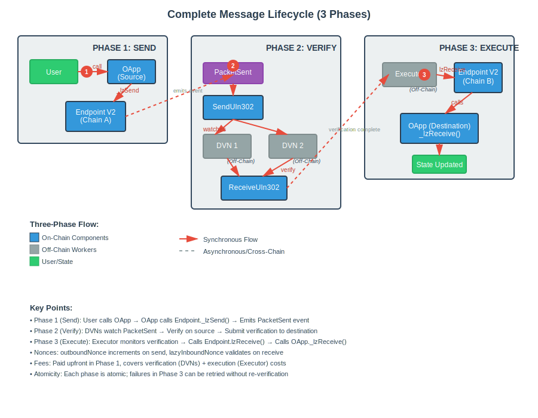
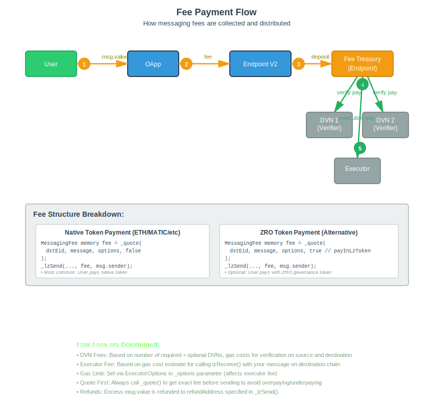

# Lesson 07 — Protocol Deep Dive

This lesson explores the low-level internals of LayerZero V2 messaging, showing exactly how packets flow through the protocol. Understanding these internals will help you debug issues, optimize gas usage, and build more sophisticated cross-chain applications.

## What You'll Learn

- How packets are structured and transmitted
- Nonce management for message ordering
- DVN verification process internals
- Message channel execution flow
- Library and ULN configuration
- Security validations at the protocol level

## Prerequisites

Before starting, you should be comfortable with:

- Lessons 01-06 (OApp fundamentals and messaging patterns)
- Solidity mappings and structs
- Cross-chain message flow at a high level

## Complete Message Lifecycle



The diagram above shows the complete flow of a message from source to destination, including all protocol components involved.

## Packet Structure

Every cross-chain message is encoded into a packet with the following structure:

```solidity
struct Packet {
    uint64 nonce;        // Unique per sender-receiver-dstEid path
    uint32 srcEid;       // Source endpoint ID
    address sender;      // OApp address on source chain
    uint32 dstEid;       // Destination endpoint ID
    bytes32 receiver;    // OApp address on destination (bytes32 for non-EVM)
    bytes32 guid;        // Global unique identifier
    bytes message;       // Your encoded payload
}
```

### GUID Generation

The GUID (Global Unique Identifier) is collision-resistant and globally unique:

```solidity
// Globally unique - collision resistant
guid = keccak256(
    abi.encodePacked(nonce, srcEid, sender.toBytes32(), dstEid, receiver)
);
```

This ensures that every message can be uniquely identified across all chains and time.

## Nonce Management

LayerZero uses two types of nonces to ensure message ordering and prevent replay attacks:

### 1. outboundNonce (Source Chain)

Tracks messages sent from an OApp to a specific receiver:

```solidity
// Tracks messages sent from this OApp to specific receiver
mapping(
    address sender =>
    mapping(uint32 dstEid =>
    mapping(bytes32 receiver => uint64 nonce))
) public outboundNonce;

// Incremented for each new message
nonce = ++outboundNonce[sender][dstEid][receiver];
```

### 2. lazyInboundNonce (Destination Chain)

Tracks the last executed message nonce:

```solidity
// Tracks last executed message nonce
mapping(
    address receiver =>
    mapping(uint32 srcEid =>
    mapping(bytes32 sender => uint64 nonce))
) public lazyInboundNonce;

// Messages must be executed in order (nonce n+1, n+2, n+3...)
// lazyInboundNonce marks the "checkpoint" - all messages before are verified
```

**Key Point**: Messages can be verified out of order by DVNs, but execution must happen in sequence. The `lazyInboundNonce` marks the checkpoint up to which all messages have been executed.

## Fee Payment Flow



### Fee Calculation

```solidity
struct MessagingFee {
    uint256 nativeFee;    // Paid in chain's native token (ETH, MATIC, etc.)
    uint256 lzTokenFee;   // Optional: pay in ZRO token
}

// Total fee = DVN fees + Executor fee + Treasury fee
totalFee = Σ(dvnFees) + executorFee + treasuryFee;
```

The fee covers:

- **DVN fees**: Payment for each DVN to verify the message
- **Executor fee**: Payment for delivering and executing on destination
- **Treasury fee**: Protocol fee for LayerZero

## DVN Verification Process

This section shows the low-level implementation that happens under the hood.

### Step 1: Assign Jobs (Source Chain)

```solidity
// SendUln302 assigns verification job to each DVN
for (uint8 i = 0; i < requiredDVNCount; i++) {
    address dvn = requiredDVNs[i];
    uint256 fee = DVN(dvn).assignJob(param, options);
    fees[dvn] += fee;  // Record for later withdrawal
}
```

### Step 2: DVNs Submit Verification (Destination Chain)

```solidity
// Each DVN calls ReceiveUln302.verify()
function verify(
    bytes calldata _packetHeader,
    bytes32 _payloadHash,
    uint64 _confirmations
) external {
    // Store witness from this DVN
    hashLookup[headerHash][payloadHash][msg.sender] =
        Verification(true, confirmations);

    emit PayloadVerified(msg.sender, _packetHeader, confirmations, payloadHash);
}
```

### Step 3: Commit Verification

```solidity
// After required DVNs + optional threshold met
function commitVerification(
    bytes calldata _packetHeader,
    bytes32 _payloadHash
) external {
    // Check all required DVNs have verified
    require(allRequiredDVNsVerified(), "Not all DVNs verified");

    // Check optional DVN threshold met
    require(optionalDVNThresholdMet(), "Threshold not met");

    // Call Endpoint to insert into message channel
    EndpointV2.verify(origin, receiver, payloadHash);
}
```

## Message Channel & Execution

### Insertion into Channel

Once verified, the message is inserted into the Endpoint's message channel:

```solidity
// ReceiveUln302 commits to Endpoint's message channel
mapping(
    address receiver =>
    mapping(uint32 srcEid =>
    mapping(bytes32 sender =>
    mapping(uint64 nonce => bytes32 payloadHash)))
) public inboundPayloadHash;

// Message is "verified" but not yet "executed"
inboundPayloadHash[receiver][srcEid][sender][nonce] = payloadHash;
```

### Execution by Executor

```solidity
function lzReceive(
    Origin calldata _origin,
    address _receiver,
    bytes32 _guid,
    bytes calldata _message,
    bytes calldata _extraData
) external payable {
    // 1. Clear payload (prevent double execution)
    _clearPayload(_receiver, _origin.srcEid, _origin.sender, _origin.nonce, payload);

    // 2. Call receiver's lzReceive
    ILayerZeroReceiver(_receiver).lzReceive{value: msg.value}(
        _origin, _guid, _message, msg.sender, _extraData
    );

    emit PacketDelivered(_origin, _receiver);
}
```

### Payload Clearing

```solidity
function _clearPayload(...) internal {
    // Update lazyInboundNonce to mark this and prior messages as executed
    if (_nonce > currentNonce) {
        // Verify all intermediate nonces exist (no gaps allowed)
        for (uint64 i = currentNonce + 1; i <= _nonce; i++) {
            require(hasPayloadHash(receiver, srcEid, sender, i), "Gap in nonces");
        }
        lazyInboundNonce[receiver][srcEid][sender] = _nonce;
    }

    // Verify payload matches
    require(keccak256(_payload) == inboundPayloadHash[...], "Wrong payload");

    // Delete to prevent re-execution
    delete inboundPayloadHash[receiver][srcEid][sender][_nonce];
}
```

**Important**: The payload clearing mechanism ensures:

1. No gaps in message execution (all prior messages must be verified)
2. Payload integrity (hash must match)
3. No double execution (payload is deleted after execution)

## Library Configuration

### SendLibrary (per destination)

```solidity
// OApp can set custom send library for each destination
mapping(address oapp => mapping(uint32 dstEid => address lib)) public sendLibrary;

// Or use default
mapping(uint32 dstEid => address lib) public defaultSendLibrary;

// Resolution: custom → default → revert
function getSendLibrary(address _sender, uint32 _dstEid) public view returns (address) {
    address lib = sendLibrary[_sender][_dstEid];
    if (lib == DEFAULT_LIB) {
        lib = defaultSendLibrary[_dstEid];
        require(lib != address(0), "No send library");
    }
    return lib;
}
```

### ReceiveLibrary (per source)

```solidity
// Similar structure for receive libraries
mapping(address oapp => mapping(uint32 srcEid => address lib)) public receiveLibrary;

// With timeout support for library upgrades
struct Timeout {
    address lib;      // Previous library
    uint256 expiry;   // Block number when timeout expires
}
```

The timeout mechanism allows for graceful library upgrades where both old and new libraries are valid during the transition period.

## ULN Configuration

Each OApp configures its security parameters per pathway:

```solidity
struct UlnConfig {
    uint64 confirmations;           // Block confirmations required
    uint8 requiredDVNCount;         // Number of required DVNs
    uint8 optionalDVNCount;         // Number of optional DVNs
    uint8 optionalDVNThreshold;     // How many optional DVNs must verify
    address[] requiredDVNs;         // Must ALL verify
    address[] optionalDVNs;         // Threshold must verify
}

// Example: 2 required + 1 of 2 optional
config = UlnConfig({
    confirmations: 15,
    requiredDVNCount: 2,
    optionalDVNCount: 2,
    optionalDVNThreshold: 1,
    requiredDVNs: [dvn1, dvn2],
    optionalDVNs: [dvn3, dvn4]
});
```

This configuration means:

- Wait for 15 block confirmations
- Both `dvn1` AND `dvn2` must verify (required)
- At least 1 of `dvn3` or `dvn4` must also verify (optional threshold)

## Executor Configuration

```solidity
struct ExecutorConfig {
    uint32 maxMessageSize;    // Max bytes for message
    address executor;         // Executor address
}

// Default: 10,000 bytes max message size
// Can be configured per OApp per destination
```

## Gas Options

OApps specify execution parameters via options:

```solidity
// Built with OptionsBuilder
bytes memory options = OptionsBuilder.newOptions()
    .addExecutorLzReceiveOption(200000, 0)        // 200k gas, 0 native value
    .addExecutorOrderedExecutionOption();         // Enforce ordering

// Enforced options (set by owner) are combined with caller options
finalOptions = combineOptions(dstEid, msgType, callerOptions);
```

### Option Types

- **LzReceiveOption**: Gas limit and native value for `_lzReceive` execution
- **NativeDropOption**: Send native tokens to an address on destination
- **ComposeOption**: Gas for composed message execution
- **OrderedExecutionOption**: Enforce strict ordering

## Security Validations

### Path Validation

```solidity
// OApp must allow path initialization
function allowInitializePath(Origin calldata origin) public view returns (bool) {
    return peers[origin.srcEid] == origin.sender;
}
```

### Receive Validation

```solidity
function lzReceive(...) public payable {
    // 1. Only Endpoint can call
    require(msg.sender == address(endpoint), "Only endpoint");

    // 2. Sender must be registered peer
    require(peers[_origin.srcEid] == _origin.sender, "Only peer");

    // 3. Process message
    _lzReceive(_origin, _guid, _message, _executor, _extraData);
}
```

These validations ensure:

- Only the LayerZero Endpoint can deliver messages
- Only registered peers can send messages to your OApp
- Path must be explicitly initialized before messages are accepted

## Message Limitations

### Max Message Size

- Default: 10,000 bytes (SendUln302)
- Configurable per OApp
- Enforced in `_payWorkers()`

### Native Gas Cap

- Executor maintains native token supply on each chain
- `nativeCap` limits amount that can be requested
- Prevents draining Executor's reserves

### Nonce Ordering

- Messages can be verified out of order
- Execution must be in order (lazyInboundNonce)
- No gaps allowed in execution sequence

## Debugging with Protocol Knowledge

Understanding these internals helps you debug common issues:

### Message Stuck in Verification

Check if all required DVNs have verified:

```solidity
// Query verification status
bool verified = receiveUln302.verifiable(packetHeader, payloadHash);
```

### Message Not Executing

Check if there are gaps in nonces:

```solidity
// Query current nonce checkpoint
uint64 currentNonce = endpoint.lazyInboundNonce(receiver, srcEid, sender);
// If your message is nonce 5 but currentNonce is 2, messages 3 and 4 must execute first
```

### Insufficient Gas on Destination

The Executor may have failed due to insufficient gas. Check your enforced options and increase the gas limit.

## Key Takeaways

1. **Packets are uniquely identified** by GUIDs derived from nonce, EIDs, and addresses
2. **Nonces ensure ordering** - messages must execute in sequence with no gaps
3. **DVN verification is flexible** - multiple DVNs with required/optional thresholds
4. **Payload clearing prevents replay** - messages can only execute once
5. **Libraries are configurable** - custom send/receive libraries per pathway
6. **ULN config controls security** - confirmations, DVNs, and thresholds per pathway
7. **Options control execution** - gas limits, native drops, and ordering

## Next Steps

Now that you understand the protocol internals, you're ready to:

- **Lesson 08**: Complete the Challenges to test your knowledge

## Resources

- [LayerZero V2 Protocol Design](https://docs.layerzero.network/v2/developers/evm/protocol-gas-settings/overview)
- [Message Library Configuration](https://docs.layerzero.network/v2/developers/evm/protocol-gas-settings/message-library)
- [DVN Configuration](https://docs.layerzero.network/v2/developers/evm/protocol-gas-settings/dvn-configuration)
- [Executor Configuration](https://docs.layerzero.network/v2/developers/evm/protocol-gas-settings/executor-configuration)
