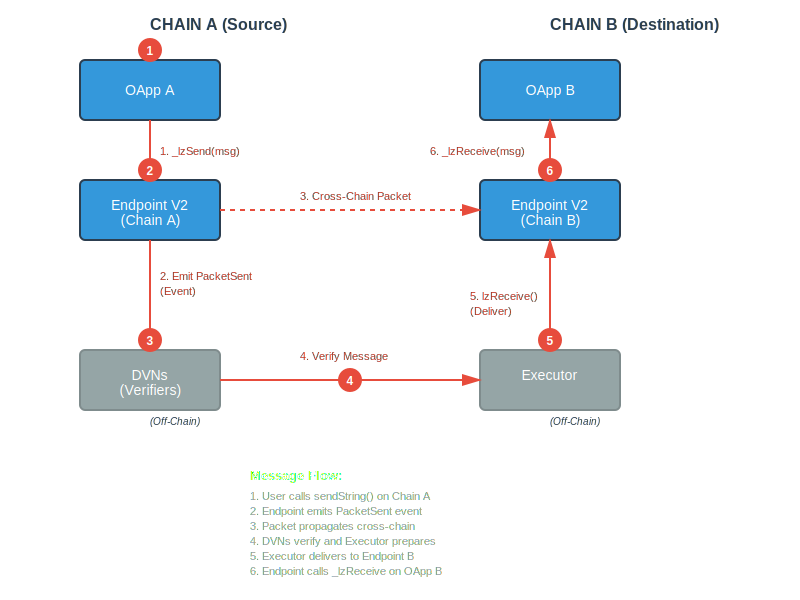
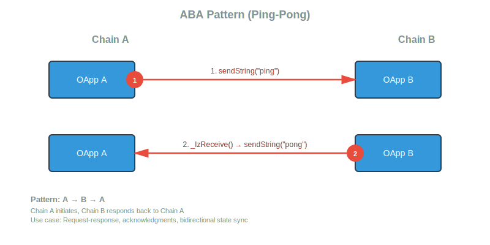
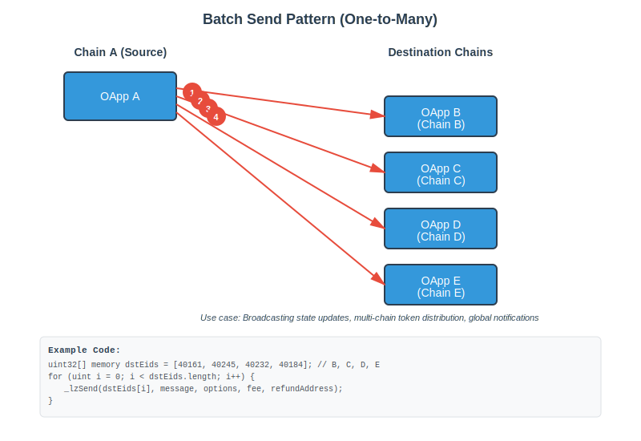

# Lesson 01 — LayerZero Basics

This lesson introduces LayerZero V2's core architecture, OApp standard, and cross-chain messaging patterns for EVM developers.

## What is LayerZero?

LayerZero is an omnichain interoperability protocol that enables smart contracts to send and receive arbitrary messages across different blockchain networks. The OApp (Omnichain Application) standard provides a simple, secure interface for building cross-chain applications.

## Key Concepts

### OApp (Omnichain Application)

The OApp standard lets your contract send and receive arbitrary messages across chains. With OApp, you can update on-chain state on one network and trigger custom business logic on another. Oapp is the foundation for all layerzero the provided courses understanding how this work will make all other courses much easier.

**OApp.sol** implements the core interface for calling LayerZero's Endpoint V2 on EVM chains and provides `_lzSend` and `_lzReceive` methods for injecting your business logic.

### Core Components

**Endpoint V2** -- LayerZero Deployed Contract

- Chain-specific contract deployed on each network
- Handles all cross-chain message sending and receiving
- Manages Security Stack (DVNs) and Executors
- Your OApp interacts with the local Endpoint

**DVNs (Decentralized Verifier Networks)**

- Off-chain services that verify cross-chain messages
- Multiple DVNs can be required for enhanced security
- Configurable per pathway (source → destination)

**Executor**

- Delivers verified messages to destination chain
- Pays gas for executing `lzReceive` on destination
- Configurable gas limits and execution options

**Message Library**

- SendUln302: Handles outbound messages
- ReceiveUln302: Handles inbound messages

## Cross-Chain Message Flow

### Simple Send/Receive Pattern



**Step-by-Step Flow:**

1. **User calls `sendString()` on Chain A**

   - OApp encodes message
   - Calls `_lzSend()` with destination EID and message

2. **Endpoint V2 on Chain A emits packet**

   - Creates unique packet with nonce
   - Emits event for off-chain workers

3. **DVNs verify the message**

   - Monitor Chain A for packet events
   - Wait for block confirmations
   - Submit verification to Chain B

4. **Executor picks up verified message**

   - Waits for required DVN confirmations
   - Prepares to deliver on Chain B

5. **Executor calls Endpoint V2 on Chain B**

   - Provides message payload and proofs
   - Pays gas for destination execution

6. **Endpoint calls `lzReceive()` on OApp B**
   - Validates sender is registered peer
   - Calls `_lzReceive()` with message
   - OApp processes message

### ABA Pattern (Ping-Pong)

The ABA pattern enables nested messaging where a message from Chain A to Chain B triggers another message back to Chain A.



Use cases:

- Cross-chain authentication
- Request-response patterns
- Conditional workflows

### Batch Send Pattern

Send multiple messages to different chains in a single transaction.



Use cases:

- Multi-chain state updates
- Broadcasting to multiple networks
- Cross-chain governance

## Protocol Deep Dive

This section explores the low-level internals of LayerZero V2 messaging, showing exactly how packets flow through the protocol.

### Complete Message Lifecycle


### Packet Structure

Every cross-chain message is encoded into a packet with the following structure:

```solidity
struct Packet {
    uint64 nonce;        // Unique per sender-receiver-dstEid path
    uint32 srcEid;       // Source endpoint ID
    address sender;      // OApp address on source chain
    uint32 dstEid;       // Destination endpoint ID
    bytes32 receiver;    // OApp address on destination (bytes32 for non-EVM)
    bytes32 guid;        // Global unique identifier
    bytes message;       // Your encoded payload
}
```

**GUID Generation:**

```solidity
// Globally unique - collision resistant
guid = keccak256(abi.encodePacked(
    nonce,
    srcEid,
    sender.toBytes32(),
    dstEid,
    receiver
));
```

### Nonce Management

LayerZero uses two types of nonces:

**1. outboundNonce** (Source Chain)

```solidity
// Tracks messages sent from this OApp to specific receiver
mapping(
    address sender =>
    mapping(uint32 dstEid =>
    mapping(bytes32 receiver => uint64 nonce))
) public outboundNonce;

// Incremented for each new message
nonce = ++outboundNonce[sender][dstEid][receiver];
```

**2. lazyInboundNonce** (Destination Chain)

```solidity
// Tracks last executed message nonce
mapping(
    address receiver =>
    mapping(uint32 srcEid =>
    mapping(bytes32 sender => uint64 nonce))
) public lazyInboundNonce;

// Messages must be executed in order (nonce n+1, n+2, n+3...)
// lazyInboundNonce marks the "checkpoint" - all messages before are verified
```

### Fee Payment Flow


**Fee Calculation:**

```solidity
struct MessagingFee {
    uint256 nativeFee;    // Paid in chain's native token (ETH, MATIC, etc.)
    uint256 lzTokenFee;   // Optional: pay in ZRO token
}

// Total fee = DVN fees + Executor fee + Treasury fee
totalFee = Σ(dvnFees) + executorFee + treasuryFee;
```

### DVN Verification Process

**Step 1: Assign Jobs (Source Chain)**

```solidity
// SendUln302 assigns verification job to each DVN
for (uint8 i = 0; i < requiredDVNCount; i++) {
    address dvn = requiredDVNs[i];
    uint256 fee = DVN(dvn).assignJob(param, options);
    fees[dvn] += fee;  // Record for later withdrawal
}
```

**Step 2: DVNs Submit Verification (Destination Chain)**

```solidity
// Each DVN calls ReceiveUln302.verify()
function verify(
    bytes calldata _packetHeader,
    bytes32 _payloadHash,
    uint64 _confirmations
) external {
    // Store witness from this DVN
    hashLookup[headerHash][payloadHash][msg.sender] =
        Verification(true, confirmations);

    emit PayloadVerified(msg.sender, _packetHeader, confirmations, payloadHash);
}
```

**Step 3: Commit Verification**

```solidity
// After required DVNs + optional threshold met
function commitVerification(
    bytes calldata _packetHeader,
    bytes32 _payloadHash
) external {
    // Check all required DVNs have verified
    require(allRequiredDVNsVerified(), "Not all DVNs verified");

    // Check optional DVN threshold met
    require(optionalDVNThreshold met(), "Threshold not met");

    // Call Endpoint to insert into message channel
    EndpointV2.verify(origin, receiver, payloadHash);
}
```

### Message Channel & Execution

**Insertion into Channel:**

```solidity
// ReceiveUln302 commits to Endpoint's message channel
mapping(
    address receiver =>
    mapping(uint32 srcEid =>
    mapping(bytes32 sender =>
    mapping(uint64 nonce => bytes32 payloadHash)))
) public inboundPayloadHash;

// Message is "verified" but not yet "executed"
inboundPayloadHash[receiver][srcEid][sender][nonce] = payloadHash;
```

**Execution by Executor:**

```solidity
function lzReceive(
    Origin calldata _origin,
    address _receiver,
    bytes32 _guid,
    bytes calldata _message,
    bytes calldata _extraData
) external payable {
    // 1. Clear payload (prevent double execution)
    _clearPayload(_receiver, _origin.srcEid, _origin.sender, _origin.nonce, payload);

    // 2. Call receiver's lzReceive
    ILayerZeroReceiver(_receiver).lzReceive{value: msg.value}(
        _origin, _guid, _message, msg.sender, _extraData
    );

    emit PacketDelivered(_origin, _receiver);
}
```

**Payload Clearing:**

```solidity
function _clearPayload(...) internal {
    // Update lazyInboundNonce to mark this and prior messages as executed
    if (_nonce > currentNonce) {
        // Verify all intermediate nonces exist (no gaps allowed)
        for (uint64 i = currentNonce + 1; i <= _nonce; i++) {
            require(hasPayloadHash(receiver, srcEid, sender, i), "Gap in nonces");
        }
        lazyInboundNonce[receiver][srcEid][sender] = _nonce;
    }

    // Verify payload matches
    require(keccak256(_payload) == inboundPayloadHash[...], "Wrong payload");

    // Delete to prevent re-execution
    delete inboundPayloadHash[receiver][srcEid][sender][_nonce];
}
```

### Library Configuration

**SendLibrary (per destination):**

```solidity
// OApp can set custom send library for each destination
mapping(address oapp => mapping(uint32 dstEid => address lib)) public sendLibrary;

// Or use default
mapping(uint32 dstEid => address lib) public defaultSendLibrary;

// Resolution: custom → default → revert
function getSendLibrary(address _sender, uint32 _dstEid) public view returns (address) {
    address lib = sendLibrary[_sender][_dstEid];
    if (lib == DEFAULT_LIB) {
        lib = defaultSendLibrary[_dstEid];
        require(lib != address(0), "No send library");
    }
    return lib;
}
```

**ReceiveLibrary (per source):**

```solidity
// Similar structure for receive libraries
mapping(address oapp => mapping(uint32 srcEid => address lib)) public receiveLibrary;

// With timeout support for library upgrades
struct Timeout {
    address lib;      // Previous library
    uint256 expiry;   // Block number when timeout expires
}
```

### ULN Configuration

Each OApp configures its security parameters per pathway:

```solidity
struct UlnConfig {
    uint64 confirmations;           // Block confirmations required
    uint8 requiredDVNCount;         // Number of required DVNs
    uint8 optionalDVNCount;         // Number of optional DVNs
    uint8 optionalDVNThreshold;     // How many optional DVNs must verify
    address[] requiredDVNs;         // Must ALL verify
    address[] optionalDVNs;         // Threshold must verify
}

// Example: 2 required + 1 of 2 optional
config = UlnConfig({
    confirmations: 15,
    requiredDVNCount: 2,
    optionalDVNCount: 2,
    optionalDVNThreshold: 1,
    requiredDVNs: [dvn1, dvn2],
    optionalDVNs: [dvn3, dvn4]
});
```

### Executor Configuration

```solidity
struct ExecutorConfig {
    uint32 maxMessageSize;    // Max bytes for message
    address executor;         // Executor address
}

// Default: 10,000 bytes max message size
// Can be configured per OApp per destination
```

### Gas Options

OApps specify execution parameters via options:

```solidity
// Built with OptionsBuilder
bytes memory options = OptionsBuilder.newOptions()
    .addExecutorLzReceiveOption(200000, 0)        // 200k gas, 0 native value
    .addExecutorOrderedExecutionOption();         // Enforce ordering

// Enforced options (set by owner) are combined with caller options
finalOptions = combineOptions(dstEid, msgType, callerOptions);
```

### Security Validations

**Path Validation:**

```solidity
// OApp must allow path initialization
function allowInitializePath(Origin calldata origin) public view returns (bool) {
    return peers[origin.srcEid] == origin.sender;
}
```

**Receive Validation:**

```solidity
function lzReceive(...) public payable {
    // 1. Only Endpoint can call
    require(msg.sender == address(endpoint), "Only endpoint");

    // 2. Sender must be registered peer
    require(peers[_origin.srcEid] == _origin.sender, "Only peer");

    // 3. Process message
    _lzReceive(_origin, _guid, _message, _executor, _extraData);
}
```

### Message Limitations

**Max Message Size:**

- Default: 10,000 bytes (SendUln302)
- Configurable per OApp
- Enforced in `_payWorkers()`

**Native Gas Cap:**

- Executor maintains native token supply
- `nativeCap` limits amount that can be requested
- Prevents draining Executor's reserves

**Nonce Ordering:**

- Messages can be verified out of order
- Execution must be in order (lazyInboundNonce)
- No gaps allowed in execution sequence

## Contract Ownership Best Practices

LayerZero's Contract Standards inherit the OpenZeppelin `Ownable` standard by default. This enables secure administration of deployed contracts.

### Why Ownership Matters

As the contract owner, you control:

- **Peer Management**: Setting trusted peers for cross-chain operations
- **Delegate Controls**: Managing addresses that can configure on your behalf
- **Enforced Options**: Configuring gas limits and execution options
- **Message Inspectors**: Security checks and message validation
- **DVN Configuration**: Choosing which verifiers to trust

### Recommended Best Practices

**1. Retain Ownership with a Secure Multisig**

❌ **Don't:** Renounce ownership of critical contracts

```solidity
// BAD - Removes ability to update configuration
oapp.renounceOwnership();
```

✅ **Do:** Transfer to a multisig wallet

```solidity
// GOOD - Maintains control with distributed security
address multisig = 0x1234...;
oapp.transferOwnership(multisig);
```

**2. Maintain Flexibility**

Retaining ownership allows you to:

- Add new cross-chain pathways
- Respond to chain-level disruptions
- Update security configurations
- Adjust gas settings for changing network conditions

**3. Document and Audit**

- Clearly document ownership and admin processes
- Regularly audit multisig settings
- Ensure appropriate quorum (e.g., 3-of-5, 4-of-7)
- Keep a disaster recovery plan

### Ownership Operations Example

```solidity
// Deploy OApp
MyOApp oapp = new MyOApp(endpoint, owner);

// Configure peers (requires ownership)
oapp.setPeer(dstEid, peerAddress);

// Set enforced options (requires ownership)
oapp.setEnforcedOptions(enforcedOptionsArray);

// Transfer to multisig for production
oapp.transferOwnership(multisigAddress);
```

## Security Considerations

### Always Validate Source

```solidity
function _lzReceive(
    Origin calldata _origin,
    bytes32 _guid,
    bytes calldata _message,
    address _executor,
    bytes calldata _extraData
) internal override {
    // Validation happens automatically via OApp.sol
    // Only registered peers can send messages
    // _origin.srcEid and _origin.sender are verified

    // Your business logic here
    processMessage(_message);
}
```

### Reentrancy Protection

Be careful with external calls in `_lzReceive`:

```solidity
// BAD - Vulnerable to reentrancy
function _lzReceive(...) internal override {
    uint256 amount = abi.decode(_message, (uint256));
    token.transfer(recipient, amount); // External call
    balances[recipient] += amount; // State change after
}

// GOOD - State changes before external calls
function _lzReceive(...) internal override {
    uint256 amount = abi.decode(_message, (uint256));
    balances[recipient] += amount; // State change first
    token.transfer(recipient, amount); // External call after
}
```

### Gas Considerations

- Always provide sufficient gas via `_options`
- Use `quoteSendString()` to estimate costs
- Account for variable gas prices on destination chains
- Set reasonable enforced options as safety nets

## Key Takeaways

1. **OApp is the foundation** for all LayerZero cross-chain messaging
2. **Endpoint V2** handles all protocol-level concerns (DVNs, Executors, verification)
3. **Peer validation** is automatic - only registered peers can communicate
4. **Ownership matters** - use multisig for production contracts
5. **Gas planning** is critical - always quote before sending
6. **Security first** - validate inputs, protect against reentrancy

## Next Steps

- **Lesson 02**: Building your first OApp with code examples
- **Lesson 03**: Deploying and testing across multiple chains
- Review `src/omnichain-messaging/MyOApp.sol` for a complete implementation

## Resources

- [LayerZero V2 Documentation](https://docs.layerzero.network/v2)
- [LayerZero GitHub](https://github.com/LayerZero-Labs)
- [LayerZero Scan](https://layerzeroscan.com) - Track your messages
- [Endpoint Addresses](https://docs.layerzero.network/v2/developers/evm/technical-reference/deployed-contracts)
